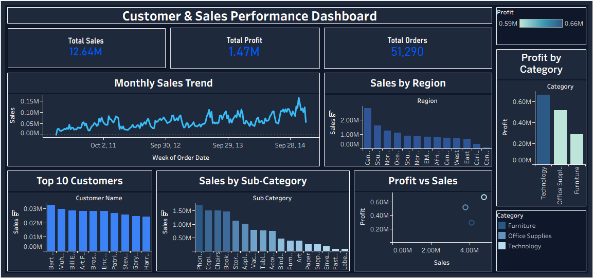

# 📊 Customer & Sales Analysis Dashboard

## 📌 Project Overview

This project focuses on analyzing retail sales data to uncover meaningful business insights related to customer behavior, sales trends, and profitability. The analysis was performed using SQL, and an interactive dashboard was built using Tableau.

---

## 🎯 Objectives

* Analyze overall sales and profit performance
* Identify top customers and high-performing products
* Understand regional sales distribution
* Track monthly sales trends
* Evaluate category-wise profitability

---

## 🧰 Tools & Technologies Used

* SQL (MySQL)
* Tableau
* Excel (Dataset)

---

## 📁 Dataset

The dataset used for this project is the **Superstore Sales Dataset**, which contains information about orders, customers, products, and sales performance.
DATASET LINK : https://www.kaggle.com/datasets/laibaanwer/superstore-sales-dataset

---

## 📊 Dashboard Features

* KPI cards showing Total Sales, Total Profit, and Total Orders
* Monthly sales trend analysis
* Sales distribution by region
* Top 10 customers by revenue
* Sales analysis by sub-category
* Profit analysis by category
* Profit vs Sales scatter plot for deeper insights

---

## 💡 Key Insights

* Technology category generates the highest profit
* Sales show a steady upward trend over time
* A small group of customers contributes significantly to total revenue
* Certain categories have high sales but lower profitability

---

## 📂 Project Structure

```
Customer-Sales-Analysis/
│
├── dataset/
├── sql/
├── tableau/
├── images/
└── README.md
```

---

## 🖼️ Dashboard Preview


